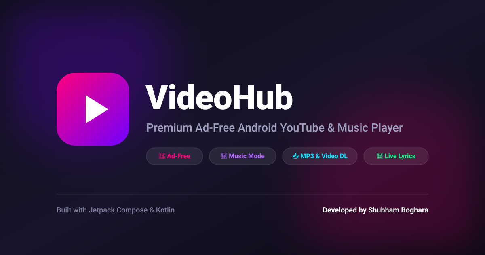

# 📱 VideoHub – Android YouTube Client

A premium, feature-rich, ad-free YouTube client for Android built with modern Jetpack Compose & Kotlin. VideoHub offers ad-free video playback, a dedicated Music Mode with synced lyrics, background audio, offline video/MP3 downloads, and complete privacy with no API keys or login required.



---

## ✨ Key Features

- 🚫 **100% Ad-Free & Private** – Enjoy seamless video watching without ads, tracking, or requiring a Google/YouTube sign-in.
- 🎵 **Dedicated Music Mode** – Transform any video into an audio-first player featuring glassmorphism blurred artwork, synced lyrics, and gesture controls.
- 🎧 **Background Audio & Mini-Player** – Keep listening to audio in the background or use Picture-in-Picture (PiP) mode.
- 📥 **Offline Downloads** – Download videos or audio-only (MP3) files directly to your device with real-time download progress tracking (in MB).
- 📜 **Synced Lyrics & Live Captions** – Enjoy multi-language subtitles and automatic synced lyrics in Music Mode.
- 🛡️ **SponsorBlock Integration** – Automatically skip sponsor segments, intros, and endcards.
- 📺 **Custom Playlists & Library** – Create and manage custom local playlists, Watch Later queue, Liked Videos, and playback history.
- 🎨 **Material 3 Design** – Modern UI with dark mode, edge-to-edge screens, and smooth transitions.
- 🌐 **Proxy Support** – Built-in proxy configuration to bypass network restrictions.

---

## 🛠️ Tech Stack & Architecture

| Category | Technology |
|----------|------------|
| **Language** | Kotlin |
| **UI Framework** | Jetpack Compose + Material Design 3 |
| **Architecture** | MVVM (Model-View-ViewModel) |
| **State Management** | StateFlow / Coroutines Flow |
| **Video Extraction** | NewPipeExtractor + OkHttp |
| **Media Playback** | AndroidX Media3 (ExoPlayer + MediaSession) |
| **Local Storage** | Room Database (with KSP) |
| **Image Loading** | Coil (`coil-compose`, `coil-video`) |
| **Navigation** | Navigation Compose |
| **Background Tasks** | Android WorkManager & Foreground Services |

---

## 🚀 Getting Started

### Prerequisites

- **Android Studio** Jellyfish / Ladybug or newer
- **JDK 11** or higher
- **Android SDK** API 26 (Android 8.0) or higher

### Setup & Installation

1. **Clone the Repository**
   ```bash
   git clone https://github.com/yourusername/VideoHub.git
   cd VideoHub
   ```

2. **Open in Android Studio**
   - Open Android Studio and choose **Open an Existing Project**.
   - Select the cloned `VideoHub` root directory.

3. **Build & Run**
   - Let Gradle sync the project dependencies.
   - Select an connected Android device or emulator (API 26+).
   - Press **Run** (`Shift + F10`).

> **Note:** VideoHub does **not** require any YouTube API keys or Google Services credentials.

---

## 👤 Author & Developer

**Shubham Boghara**
- **GitHub**: [shubhmboghara](https://github.com/shubhmboghara/)
- **Instagram**: [@shubhambogharadotcom](https://www.instagram.com/shubhambogharadotcom?igsh=NDFpNnY2MXJ5czVi&igsi=NDFpNnY2MXJ5czVi)
- **LinkedIn**: [Shubham Boghara](https://in.linkedin.com/in/shubham-boghara-60b4a1343)

---

## 📄 License

This project is open-source and built for educational and personal use.
